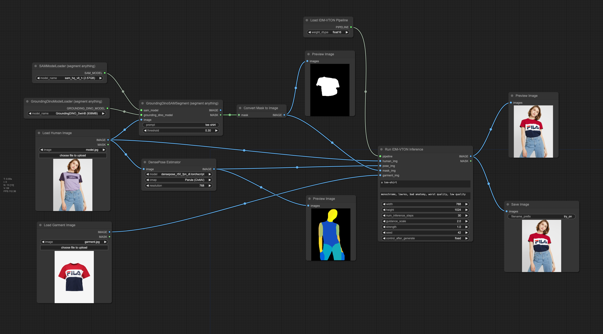

# ComfyUI-IDM-VTON
ComfyUI adaptation of [IDM-VTON](https://github.com/yisol/IDM-VTON).



## Installation

:warning: Current implementation requires GPU with at least 16GB of VRAM :warning:

### Using ComfyUI Manager:

- In [ComfyUI Manager](https://github.com/ltdrdata/ComfyUI-Manager), look for ```ComfyUI-IDM-VTON```, and be sure the author is ```TemryL```. Install it.

### Manually:
- Clone this repo into `custom_nodes` folder in ComfyUI and install the dependencies.
```bash
cd custom_nodes
git clone https://github.com/TemryL/ComfyUI-IDM-VTON.git
cd ComfyUI-IDM-VTON
python install.py
```

Models weights from [yisol/IDM-VTON](https://huggingface.co/yisol/IDM-VTON) in [HuggingFace](https://huggingface.co) will be downloaded in [models](models/) folder of this repository.

## Mask Generation
The workflow provided above uses [ComfyUI Segment Anything](https://github.com/storyicon/comfyui_segment_anything) to generate the image mask.

## DensePose Estimation
DensePose estimation is performed using [ComfyUI's ControlNet Auxiliary Preprocessors](https://github.com/Fannovel16/comfyui_controlnet_aux).

## :star: Star Us!
If you find this project useful, please consider giving it a star on GitHub. This helps the project to gain visibility and encourages more contributors to join in. Thank you for your support!

## Contribute
Thanks for your interest in contributing to the source code! We welcome help from anyone and appreciate every contribution, no matter how small!

If you're ready to contribute, please create a fork, make your changes, commit them, and then submit a pull request for review. We'll consider it for integration into the main code base.

## Credits
- [ComfyUI](https://github.com/comfyanonymous/ComfyUI)
- [IDM-VTON](https://github.com/yisol/IDM-VTON)
- [ComfyUI Segment Anything](https://github.com/storyicon/comfyui_segment_anything)
- [ComfyUI's ControlNet Auxiliary Preprocessors](https://github.com/Fannovel16/comfyui_controlnet_aux)

## License
Original [IDM-VTON](https://github.com/yisol/IDM-VTON) source code under [CC BY-NC-SA 4.0 license](https://creativecommons.org/licenses/by-nc-sa/4.0/legalcode).
